# ARSW - Laboratorio 10

## Laboratorio – Escalamiento en Azure con Maquinas Virtuales, Sacale Sets y Service Plans

## Integrantes:

- Eduard Arias
- James Torres

### Descripción
Adjunto a este laboratorio usted podrá encontrar una aplicación totalmente desarrollada que tiene como objetivo calcular el enésimo valor de la secuencia de Fibonnaci.
Escalabilidad Cuando un conjunto de usuarios consulta un enésimo número (superior a 1000000) de la secuencia de Fibonacci de forma concurrente y el sistema se encuentra bajo condiciones normales de operación, todas las peticiones deben ser respondidas y el consumo de CPU del sistema no puede superar el 70%.

### *PARTE I: Escalabilidad vertical*

Se crea la maquina virtual.

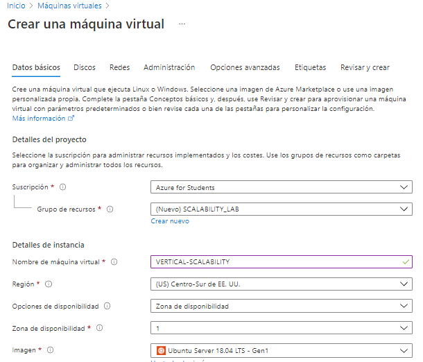 

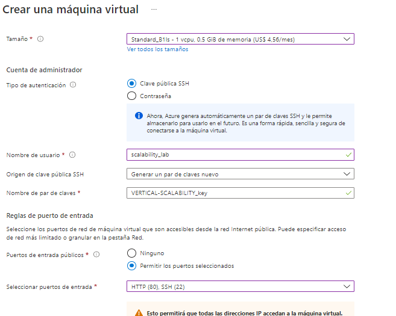

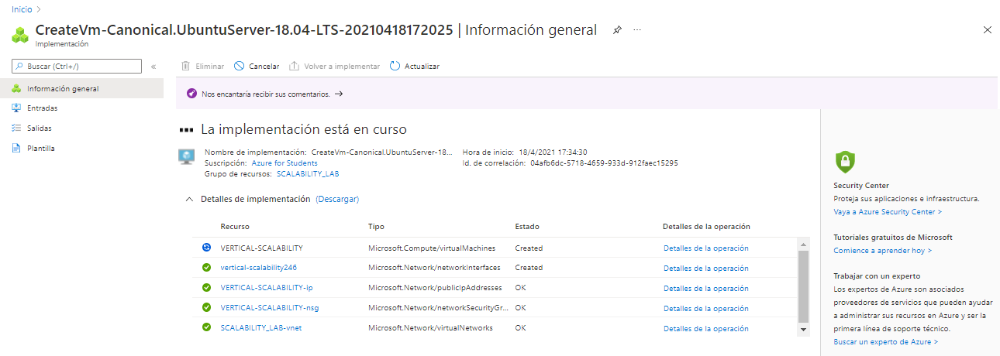 

Se realiza la conexión ssh y se instala dependencias. 

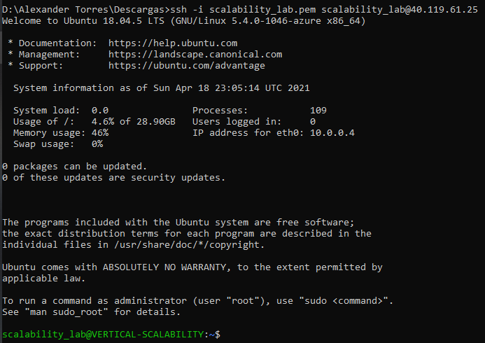 

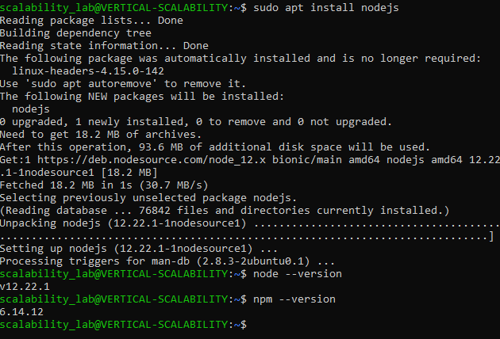 

Se clona el repositorio y se instala Postman.

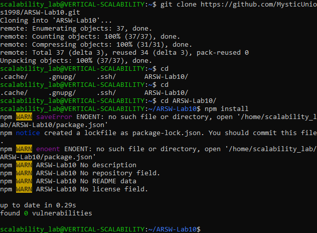 

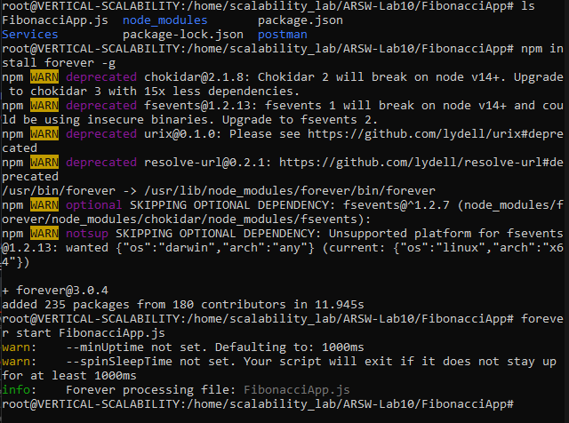

Se agrega reglas de seguridad de entrada.

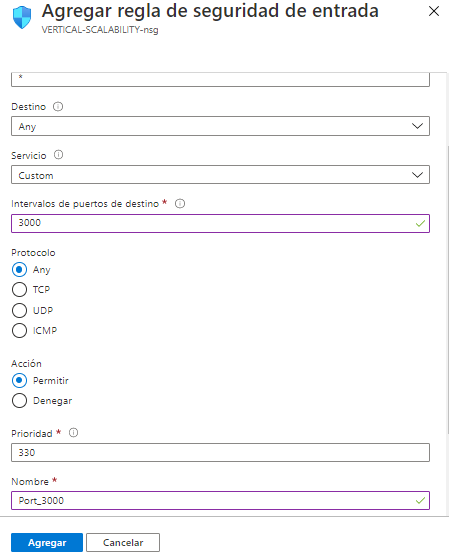  

Se realiza prueba en navegador.

### Preguntas

1. ¿Cuántos y cuáles recursos crea Azure junto con la VM?
2. ¿Brevemente describa para qué sirve cada recurso?

Se crean 8 recursos, los cuales son:

	- Maquina virtual
	Recurso usado para alojar la aplicacion sin tener equipo fisico.

	- Clave SSH
	Recurso para realizar la conexion a la maquina virtual por medio de la llave.

	- Network Watcher
	Recurso que monitorea y repara el estado de la red. 

	- Red virtual
	Recurso que administra la red 

	- Direccion IP publica
	Recurso que administra la ip publica de la maquina virtual
	
	- Grupo de seguridad
	Recurso que mantiene y gestiona la seguridad de la maquina virtual, que permiten o niegan el trafico	

	- Interfaz de red
	Recurso que permite que una maquina se conecte con internet y recursos locales.

	- Disco
	Recurso que permite tener el almacenamiento de la maquina virtual

3. ¿Al cerrar la conexión ssh con la VM, por qué se cae la aplicación que ejecutamos con el comando npm FibonacciApp.js? ¿Por qué debemos crear un Inbound port rule antes de acceder al servicio?

Al cerra la conexion ssh terminamos la ejecucion del proceso "FibonacciApp.js" por eso se cae.

Se debe crear un Inbound port rule para permitir el acceso al servicio publico.

4. Adjunte tabla de tiempos e interprete por qué la función tarda tando tiempo.

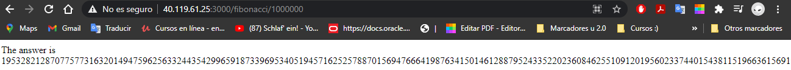
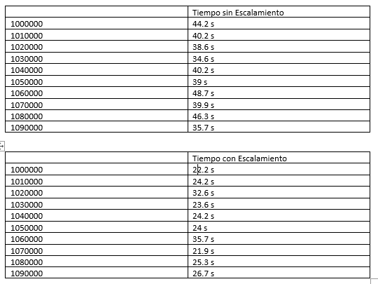

5. Adjunte imágen del consumo de CPU de la VM e interprete por qué la función consume esa cantidad de CPU.

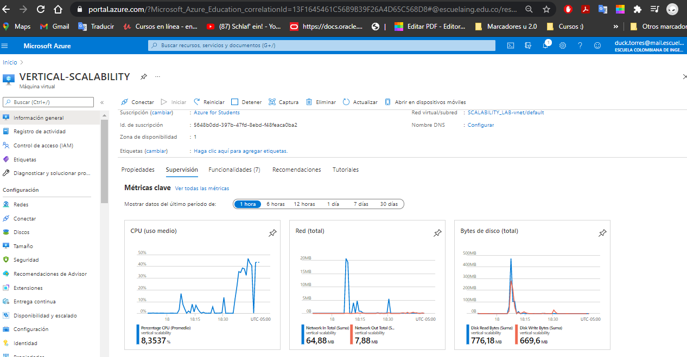

Antes del escalamiento vertical el consumo de la cpu llego a casi el 95% y despues del escalamiento el consumo de cpu llega casi al 50%.

6. Adjunte la imagen del resumen de la ejecución de Postman. Interprete:
	
	- Se realiza la configuracion y se coloca la ip
	
	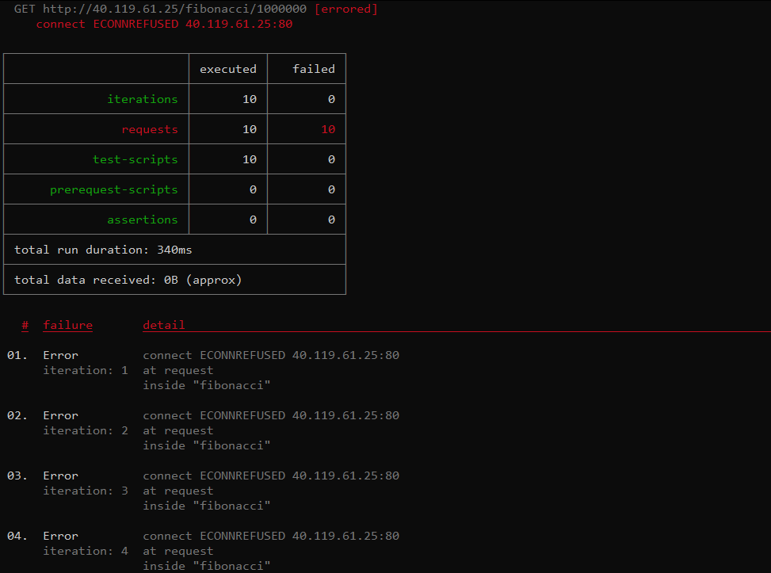

	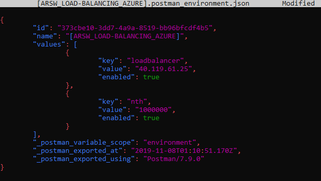
	
	- Se realiza el analisis de forma correcta

	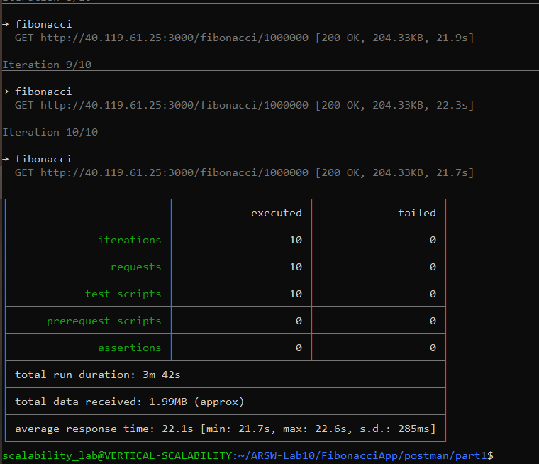

	Tiempos de ejecución de cada petición.

	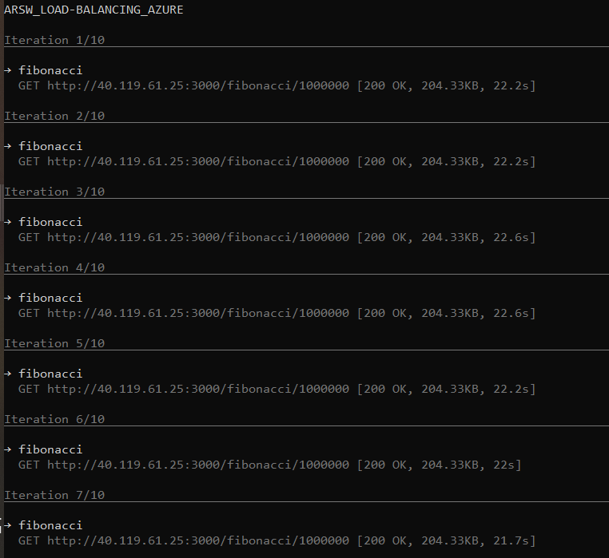

	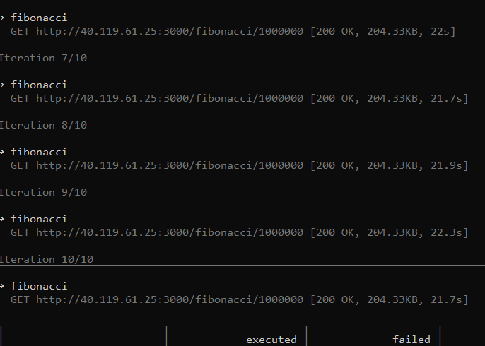

	Si hubo fallos documentelos y explique.
	
	- antes de realizar las peticiones fallaba ya que la ip era diferente a la del recurso asignado.

7. ¿Cuál es la diferencia entre los tamaños B2ms y B1ls (no solo busque especificaciones de infraestructura)?

cambio de tamaño.	
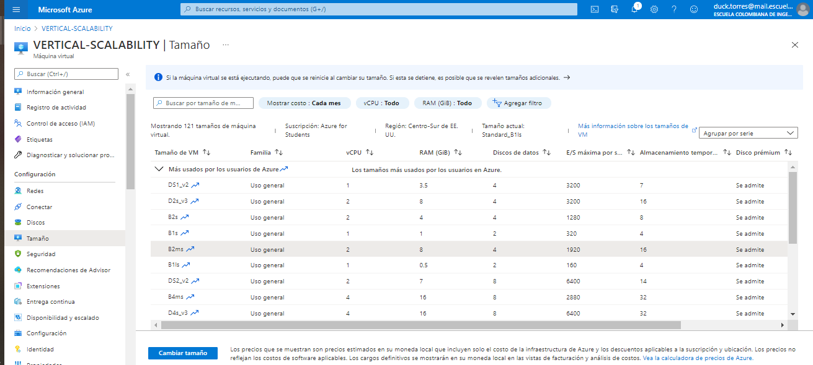

	- B1ls tiene memoria mas pequeña pero su costo es el mas bajo y el B2ms tiene una memoria mucho mas amplia de 8 GiB y mayor cpu por ende mejor rendimienton pero su costo es mayor al anterior.

8. ¿Aumentar el tamaño de la VM es una buena solución en este escenario?, ¿Qué pasa con la FibonacciApp cuando cambiamos el tamaño de la VM?
	- Seria buena solucion al mejorar la capacidad de procesamiento mejoran la carga de la cpu y sus tiempos.

9. ¿Qué pasa con la infraestructura cuando cambia el tamaño de la VM? ¿Qué efectos negativos implica?
	- El costo de esta implementacion es muy alto para mantener.

10. ¿Hubo mejora en el consumo de CPU o en los tiempos de respuesta? Si/No ¿Por qué?
	- Tiene mejoras en el consumo de cpu ya que cuenta con mayot capacidad de procesamiento.

11. Aumente la cantidad de ejecuciones paralelas del comando de postman a 4. ¿El comportamiento del sistema es porcentualmente mejor?
	- El porcentaje del comportamiento es mejor ya que presenta menos fallos.

### *PARTE II: Escalabilidad horizontal*

